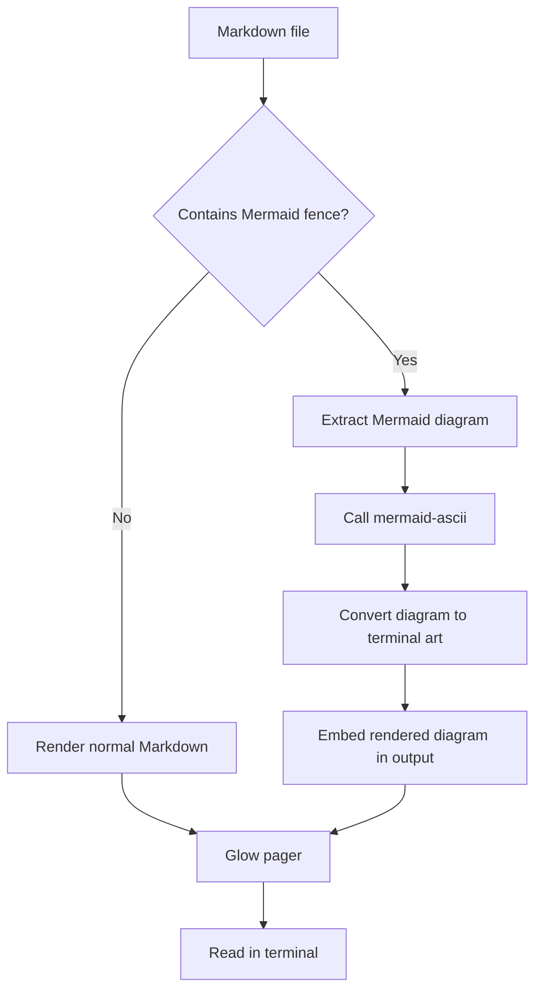

update the mermaid rendering part by allowing it to adapt to the width of the terminal

```mermaid
flowchart TD
    A[Markdown file] --> B{Contains Mermaid fence?}
    B -- No --> C[Render normal Markdown]
    B -- Yes --> D[Extract Mermaid diagram]
    D --> E[Call mermaid-ascii]
    E --> F[Convert diagram to terminal art]
    F --> G[Embed rendered diagram in output]
    C --> H[Glow pager]
    G --> H
    H --> I[Read in terminal]
```
